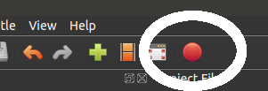

Introduction
============

This is a tutorial that explains how to generate videos of sheet music that scroll
along with an audio track, using the free and open source programs OpenShot
and lilypond.  We sometimes use this process to make hymns for the virtual church
services at [The First Presbyterian Church of Ithaca, NY](https://www.firstpresithaca.org/).

This tutorial is targeted at someone who is technically savvy but doesn't
necessarily have experience editing video or music files.

The example output video is available [here](https://youtu.be/xXDTDvyrqU8).

TODO: There is a video tutorial of the process here:

You can download a zip file with all of these example files
[here](https://github.com/mdgeorge4153/hymns/archive/main.zip).

I'm interested in improving this tutorial and helping people make hymn videos,
so if you have questions or comments or find a better way of doing something,
feel free to let me know!

Generating the sheet music
==========================

Creating the video requires an image of the sheet music.  This section contains
instructions for creating such an image.

The easy way <a anchor="easy"/>
------------------------------

I use lilypond to generate the image so that I can put each verse on its own
line and control the fonts and formatting.  However, lilypond has a
learning curve and can be time-consuming; if you'd like to skip it, you can
generate the image any way that is convenient.

For example, you could scan the page from a hymnal or try to find it on the
internet.

OpenShot can't use PDF files, but most PDF viewers have a way to turn a PDF
into an image.  If your software asks you to choose an image size, choosing a
width of 1280 pixels will give you an HD-quality image.

If you're familiar with the command line, you can use the `pdftoppm` command to
convert pdfs to images:

    pdftoppm -png -scale-to-x 1280 -scale-to-y -1 36_for_the_fruit.pdf > 36_for_the_fruit.png

### Places where you can find existing hymn images

TODO: if you know of any, let me know!

Generating Sheet Music Using lilypond
-------------------------------------

Lilypond is music transcription software.  It lets you type music in a
(somewhat) convenient format, and then processes that description to produce
beautiful sheet music.

Using lilypond to generate music images gives you a lot of control over the
appearance of the music.  It also lets you reuse the examples provided in this
documentation.  The file [LILYPOND.md](LILYPOND.md) provides a detailed lilypond
tutorial tailored for generating hymn images for these videos.

To use lilypond, you will need to be comfortable with editing text files and
with reading sheet music.  If you are familiar with reading sheet music but not
editing text files, you might try using one of the graphical lilypond editors
[listed here](https://lilypond.org/easier-editing.html).
I have not used them, and so can't comment on the process.

I find it takes about an hour for me to enter a hymn into lilypond; it will
probably take longer while you're learning.

If lilypond seems too daunting, I recommend producing sheet music as
described in the ["Easy Way" section](#easy) above, and then skipping to the
["Generating the video" section](#video) below.

Generating the video
====================

This section describes how to combine an audio file and an image of some sheet
music to create a video that scrolls the sheet music along with the audio.  The
tutorial uses the free video editing package OpenShot, but the concepts should
be the same for other video editing software.

Installing and setting up OpenShot
----------------------------------

You can download OpenShot [here](https://www.openshot.org/download/).

Alternatively, if you use a package manager, you can use that to install
openshot.

When you run openshot, you will see something like this:

You should add your sheet music image and audio file to the Project files section,
either by dragging and dropping them, or right clicking and selecting "Add Files",
or by selecting "Import Files" from the File menu.

You will also need to make the "Properties" panel visible.  In the menu, select
View > Views > Advanced View.  This will show several additional panels, but we
only need the "Properties" panel.  If you want, you can close some of the
panels by clicking the x's in the corner, or rearrange them by clicking on
their titles and dragging.  Here's how I set my view up:

You should also set the project profile so that your video is the right size.
Click the "Choose Profile" button:

There are a lot of profiles to pick from.  You probably want HD 1080p 24fps.
If you want a widescreen format, choose HD 720p 24fps.  If you're making the
hymn as part of a larger video, choose whatever format the larger video is
using.

Save the project (Ctrl+S or File > Save project) and give it a name.  This
doesn't generate a video.  Instead, it saves your OpenShot setup.

A bit about keyframes and animation
-----------------------------------

Before diving in to editing the video, let's talk about a few of the important
animation concepts that you will use.

Most animations are based on _properties_, _keyframes_, and _interpolation_.

* A property is something that can change over time, like the transparency of a
  video clip, the volume of an audio clip, or the position of an image.

* A keyframe is a point in time when a property should have a particular value.
  For example, to fade in a video clip over the span of 2 seconds, you would
  want it to be fully transparent at time 0:00 and fully opaque at time 0:02.
  To accomplish this, you would set a keyframe at 0:00 with full transparency
  and a keyframe at 0:02 with full opacity.

* Between keyframes, property values are automatically _interpolated_ between
  the values given at the keyframes.  In the fade-in example, half-way through
  the fade the video would be half opaque, and three-quarters
  of the way through it would be 3/4 opaque (this is the simplest case; in
  reality you might want the animation to slow down over time, in which case
  you would use a different curve.  More on this later).

For our purposes, we want to periodically shift the position of the image on
the screen.  We will accomplish this by setting keyframes for the position
property just before and just after the time of each shift.  During the shift,
the position will be interpolated from one position to the next.

Setting up the audio and image
------------------------------

Start by adding the audio clip to one of the tracks on the Timeline view.  Drag
it so that it is all the way to the left (at 0:00).  It doesn't matter which
track; I'll use track 4.

You can zoom the timeline in and out using the slider just above it.  Here I've
set it to 20 second intervals, so that the entire audio file is visible:

Now, add the image to a different track.  Shift it to the beginning, and expand
it so that it is the same length as the audio track:

If the image is a little longer then the video will be a bit longer, which is
fine; if you want them to match up exactly you can zoom in on the timeline to
match them up.

By default, the image gets shrunk down to fit on the screen, but we want to
crop it instead.  Click on the image in the timeline so that it is selected (it
will have a red outline).  In the properties panel, find the "Scale" property
and right click to change it from "Best Fit" to "Crop".

You should see the middle of your music filling the video preview.

Scrolling the image
-------------------

At the beginning of the song, we want the image to be positioned so that the
top is visible.   With the blue pointer set at 0:00 on the timeline and the
image selected, find the "Location Y" property in the properties panel.  By
default it's value is 0.00; dragging to the left or the right will move the
page up or down in the preview window.

Unfortunately, it seems you can't drag it all the way to the top.  However, you
can enter numeric values.  Play around with it a bit to find where you want to
start; after some fiddling I settled on 2.2.

Changing the property in the property editor creates a keyframe for that property
at the point in time indicated by the blue cursor in the timeline.  We've now
set a keyframe at the beginning.  What remains is to set the other keyframes.

We'll start by marking the points on the timeline when we want to scroll.  The
add marker button adds a marker at the current location on the timeline:

Click play on the preview window, and then click the marker whenever you want
to move the page (if you want, you can remove a marker by right clicking on it).
I chose to scroll after each phrase, so I ended up with 11 transition points
marked:

You can move the cursor to the next or previous marker by using the arrow buttons to the
right of the add marker button.

Let's put in the first transition.  Move the cursor to the first marker.  We want
to add a keyframe a little before the transition with the current image location,
and then another keyframe a little after the transition with the new image
location.

You can use the arrow keys to adjust the cursor frame by frame.  By pressing the
left key about 6 times, you move a quarter second earlier than the marker.  With
the cursor there (and the image still selected on the timeline), right click on
the "Location Y" property name and select "Insert Keyframe".  You'll see that the
property turns green to indicate that there is a keyframe on the current frame,
and a little green mark appears on the timeline.  Properties appear green if
there is a keyframe on the current frame, and blue if there is a keyframe on a
different frame.

Now, move the cursor 6 frames to the right of the marker.  Adjust the "Location
Y" property so that the music is in the new position.  Changing a property
automatically creates a new keyframe, so you don't have to manually create one.

Use the play button on the preview pane to watch your first transition.  You
may notice that the transition starts and ends very suddenly.  You can create a
smoother transition by choosing a different curve.  To do so, right click on the
little line icon that appears next to the "Location Y" value, and select
Bezier > Ease.  This will cause the transition to start and end slowly.

You may want to adjust the timing to be earlier or later.  The easiest way to
do that is to remove the keyframes for the incorrect transition (by right
clicking on the property and selecting "Remove Keyframe") and then adding a new
transition.  You should set the "Location Y" property for the keyframe before
the transition to the same value as the previous keyframe, and for the
post-transition keyframe the value should be the same as the next keyframe.

The remaining transiitons work the same way.  Move a few frames to the left of
your next marker and insert a keyframe for the "Location Y" property.  Then
move a few frames to the right and change the "Location Y" property to the
next position.  If necessary, change the curve to "Ease".

Once you're happy with your video, it is time to export it.  Click the big
red export button on the toolbar:

Under "Profile", select "Web".  This will change the "Target" menu so that it
has options for many common websites.  We post our videos on YouTube, so I've
selected "YouTube HD".  Select a video profile that matches the one you chose
above, set the desired quality level, and click export to produce a video file.
It may take a few minutes or more depending on how fast your computer is.

Credits
=======

This tutorial was put together by Michael George <mdgeorge@cs.cornell.edu>

TODO: music credits

Contributing
------------

TODO: use github

